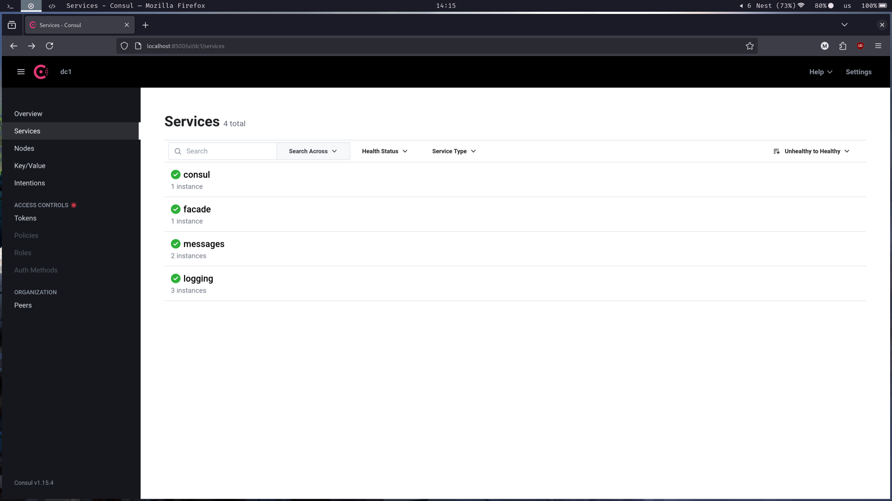
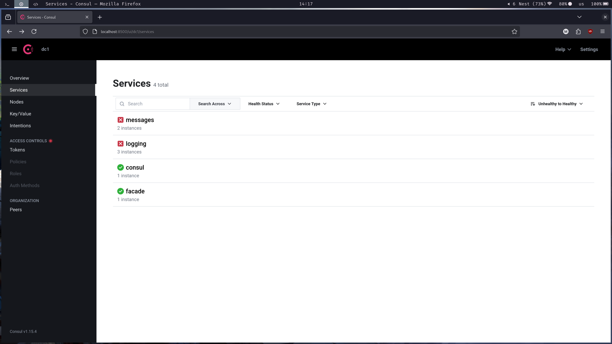
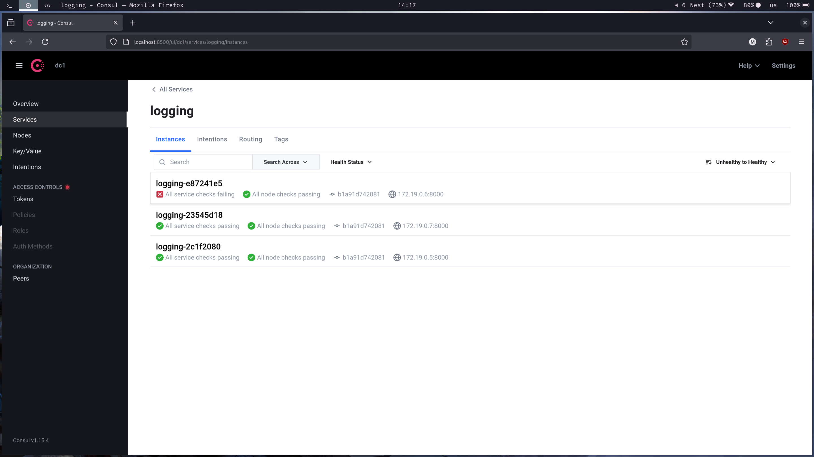
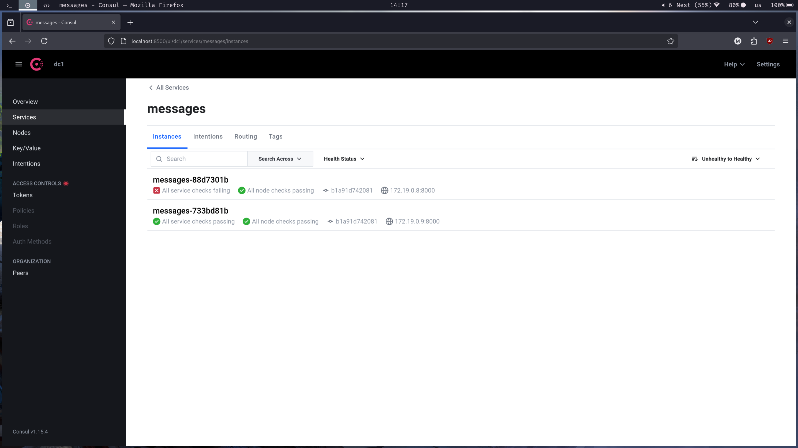

# Systems arch homework 3: Microservices with hazelcast

## Setup

This time, i used the previous task as base.
The only change to the setup was this -
i added the consul container to `docker-compose.yml.
```docker
# Consul
consul:
  image: consul:1.15.4
  container_name: consul
  ports:
    - "8500:8500"
  command: "consul agent -dev -client=0.0.0.0"
  networks:
```

I then added the changes mentioned lower started the docker-comkpose script.
This is what i got:



Then, i did this:

```sh
docker kill logging_service_1
docker kill message-service-2
```

And this is what i got:








## Facade

Facade is also the same as the last time.
The only change is `get_service_url`, startup and `health` endpoint

```python
@app.on_event("startup")
def register_facade():
    service_name = "facade"
    service_port = 8000
    service_id = f"{service_name}-{str(uuid.uuid4())[:8]}"
    ip_address = socket.gethostbyname(socket.gethostname())

    data = {
        "ID": service_id,
        "Name": service_name,
        "Address": ip_address,
        "Port": service_port,
        "Check": {
            "HTTP": f"http://{ip_address}:{service_port}/health",
            "Interval": "10s",
        },
    }
    try:
        requests.put("http://consul:8500/v1/agent/service/register", json=data)
    except Exception as e:
        print(f"Consul registration failed: {e}")

def get_service_url(service_name: str):
    try:
        res = requests.get(
            f"http://consul:8500/v1/health/service/{service_name}?passing=true"
        )
        services = res.json()
        if not services:
            raise HTTPException(
                status_code=500, detail=f"No healthy instances of {service_name}"
            )
        instance = random.choice(services)["Service"]
        return f"http://{instance['Address']}:{instance['Port']}"
    except Exception as e:
        raise HTTPException(status_code=500, detail=f"Consul error: {str(e)}")
```


## Logger

Same with logger, I added conencting to consul on startup and the health checkpoint.

```python
@app.on_event("startup")
async def startup_event():
    """Registers this logging service instance with the config server on startup."""
    name = "logging"
    port = PORT
    ip = socket.gethostbyname(socket.gethostname())
    sid = f"{name}-{str(uuid.uuid4())[:8]}"

    requests.put(
        "http://consul:8500/v1/agent/service/register",
        json={
            "ID": sid,
            "Name": name,
            "Address": ip,
            "Port": port,
            "Check": {"HTTP": f"http://{ip}:{port}/health", "Interval": "10s"},
        },
    )


@app.get("/health")
def health():
    return {"status": "ok"}
```

## Results

I used curl and created this script:
```
curl -X POST "http://localhost:8000/messages" -H "Content-Type: application/json" -d '{"msg":"Hello, Kafka!"}'

curl -X GET "http://localhost:8000/messages"
```

Here are the logs for ten times:
 ### Facade

```
INFO:     Started server process [1]
INFO:     Waiting for application startup.
INFO:     Application startup complete.
INFO:     Uvicorn running on http://0.0.0.0:8000 (Press CTRL+C to quit)
INFO:     172.19.0.2:41620 - "GET /health HTTP/1.1" 200 OK
INFO:     172.19.0.2:48848 - "GET /health HTTP/1.1" 200 OK
INFO:     172.19.0.1:60880 - "POST /messages HTTP/1.1" 200 OK
INFO:     172.19.0.1:60884 - "POST /messages HTTP/1.1" 200 OK
INFO:     172.19.0.1:60900 - "POST /messages HTTP/1.1" 200 OK
INFO:     172.19.0.1:60902 - "POST /messages HTTP/1.1" 200 OK
INFO:     172.19.0.1:60912 - "POST /messages HTTP/1.1" 200 OK
INFO:     172.19.0.1:60922 - "POST /messages HTTP/1.1" 200 OK
INFO:     172.19.0.1:60928 - "POST /messages HTTP/1.1" 200 OK
INFO:     172.19.0.1:60942 - "POST /messages HTTP/1.1" 200 OK
INFO:     172.19.0.1:60958 - "POST /messages HTTP/1.1" 200 OK
INFO:     172.19.0.2:50504 - "GET /health HTTP/1.1" 200 OK
INFO:     172.19.0.2:48642 - "GET /health HTTP/1.1" 200 OK
INFO:     172.19.0.2:59402 - "GET /health HTTP/1.1" 200 OK
INFO:     172.19.0.2:43266 - "GET /health HTTP/1.1" 200 OK
INFO:     172.19.0.2:36020 - "GET /health HTTP/1.1" 200 OK
INFO:     Shutting down
```

### Logger 1

```
logging_service_1  | INFO:     Started server process [1]
logging_service_1  | INFO:     Waiting for application startup.
logging_service_1  | INFO:     Application startup complete.
logging_service_1  | INFO:     Uvicorn running on http://0.0.0.0:8000 (Press CTRL+C to quit)
logging_service_1  | INFO:     172.19.0.2:59214 - "GET /health HTTP/1.1" 200 OK
logging_service_1  | INFO:     172.19.0.2:33686 - "GET /health HTTP/1.1" 200 OK
logging_service_1  | INFO:     172.19.0.2:45856 - "GET /health HTTP/1.1" 200 OK
logging_service_1  | INFO:     Shutting down
logging_service_1  | INFO:     Waiting for application shutdown.
logging_service_1  | INFO:     Application shutdown complete.
logging_service_1  | INFO:     Finished server process [1]
logging_service_1  | INFO:     Started server process [1]
logging_service_1  | INFO:     Waiting for application startup.
logging_service_1  | INFO:     Application startup complete.
logging_service_1  | INFO:     Uvicorn running on http://0.0.0.0:8000 (Press CTRL+C to quit)
logging_service_1  | INFO:     172.19.0.3:60650 - "GET /health HTTP/1.1" 200 OK
logging_service_1  | INFO:     172.19.0.3:58558 - "GET /health HTTP/1.1" 200 OK
logging_service_1  | INFO:     172.19.0.3:40632 - "GET /health HTTP/1.1" 200 OK
logging_service_1  | INFO:     172.19.0.3:45228 - "GET /health HTTP/1.1" 200 OK
logging_service_1  | INFO:     172.19.0.3:37586 - "GET /health HTTP/1.1" 200 OK
logging_service_1  | INFO:     172.19.0.3:54316 - "GET /health HTTP/1.1" 200 OK
logging_service_1  | INFO:     172.19.0.3:42142 - "GET /health HTTP/1.1" 200 OK
logging_service_1  | INFO:     172.19.0.3:60988 - "GET /health HTTP/1.1" 200 OK
logging_service_1  | INFO:     172.19.0.3:38624 - "GET /health HTTP/1.1" 200 OK
logging_service_1  | INFO:     172.19.0.3:51934 - "GET /health HTTP/1.1" 200 OK
logging_service_1  | INFO:     172.19.0.3:40158 - "GET /health HTTP/1.1" 200 OK
logging_service_1  | INFO:     172.19.0.3:37826 - "GET /health HTTP/1.1" 200 OK
logging_service_1  | INFO:     172.19.0.3:59776 - "GET /health HTTP/1.1" 200 OK
logging_service_1  | INFO:     172.19.0.3:36596 - "GET /health HTTP/1.1" 200 OK
logging_service_1  | INFO:     172.19.0.3:53632 - "GET /health HTTP/1.1" 200 OK
logging_service_1  | INFO:     172.19.0.3:36888 - "GET /health HTTP/1.1" 200 OK
logging_service_1  | INFO:     172.19.0.3:53196 - "GET /health HTTP/1.1" 200 OK
logging_service_1  | INFO:     172.19.0.3:48288 - "GET /health HTTP/1.1" 200 OK
logging_service_1  | INFO:     172.19.0.3:49614 - "GET /health HTTP/1.1" 200 OK
logging_service_1  | INFO:     172.19.0.3:50108 - "GET /health HTTP/1.1" 200 OK
logging_service_1  | INFO:     172.19.0.3:55380 - "GET /health HTTP/1.1" 200 OK
logging_service_1  | INFO:     172.19.0.3:44304 - "GET /health HTTP/1.1" 200 OK
logging_service_1  | INFO:     172.19.0.3:47774 - "GET /health HTTP/1.1" 200 OK
logging_service_1  | INFO:     172.19.0.3:52836 - "GET /health HTTP/1.1" 200 OK
logging_service_1  | INFO:     172.19.0.3:59652 - "GET /health HTTP/1.1" 200 OK
logging_service_1  | INFO:     172.19.0.3:47562 - "GET /health HTTP/1.1" 200 OK
logging_service_1  | INFO:     172.19.0.3:43590 - "GET /health HTTP/1.1" 200 OK
logging_service_1  | INFO:     172.19.0.3:36244 - "GET /health HTTP/1.1" 200 OK
logging_service_1  | INFO:     172.19.0.3:33264 - "GET /health HTTP/1.1" 200 OK
logging_service_1  | INFO:     172.19.0.3:39986 - "GET /health HTTP/1.1" 200 OK
logging_service_1  | INFO:     Shutting down
logging_service_1  | INFO:     Waiting for application shutdown.
logging_service_1  | INFO:     Application shutdown complete.
logging_service_1  | INFO:     Finished server process [1]
logging_service_1  | INFO:     Started server process [1]
logging_service_1  | INFO:     Waiting for application startup.
logging_service_1  | INFO:     Application startup complete.
logging_service_1  | INFO:     Uvicorn running on http://0.0.0.0:8000 (Press CTRL+C to quit)
logging_service_1  | INFO:     172.19.0.3:50750 - "GET /health HTTP/1.1" 200 OK
logging_service_1  | INFO:     172.19.0.3:51088 - "GET /health HTTP/1.1" 200 OK
logging_service_1  | INFO:     Shutting down
logging_service_1  | INFO:     Waiting for application shutdown.
logging_service_1  | INFO:     Application shutdown complete.
logging_service_1  | INFO:     Finished server process [1]
logging_service_1  | INFO:     Started server process [1]
logging_service_1  | INFO:     Waiting for application startup.
logging_service_1  | INFO:     Application startup complete.
logging_service_1  | INFO:     Uvicorn running on http://0.0.0.0:8000 (Press CTRL+C to quit)
logging_service_1  | INFO:     172.19.0.2:39058 - "GET /health HTTP/1.1" 200 OK
logging_service_1  | INFO:     172.19.0.2:36222 - "GET /health HTTP/1.1" 200 OK
logging_service_1  | Received message - ID: e7ab7ab3-d10a-4e8e-af91-399248d52f14, Content: Hello, Kafka!
logging_service_1  | INFO:     172.19.0.10:42254 - "POST /messages HTTP/1.1" 200 OK
logging_service_1  | Received message - ID: d3c78c21-86e4-417d-8281-fab9495679cd, Content: Hello, Kafka!
logging_service_1  | INFO:     172.19.0.10:42260 - "POST /messages HTTP/1.1" 200 OK
logging_service_1  | Received message - ID: bae5667b-67e4-4265-90e5-ba103800ed0a, Content: Hello, Kafka!
logging_service_1  | INFO:     172.19.0.10:42272 - "POST /messages HTTP/1.1" 200 OK
logging_service_1  | Received message - ID: b4d0e6f5-8d94-4c6a-9c7c-2c57677a988b, Content: Hello, Kafka!
logging_service_1  | INFO:     172.19.0.10:42288 - "POST /messages HTTP/1.1" 200 OK
logging_service_1  | INFO:     172.19.0.2:35174 - "GET /health HTTP/1.1" 200 OK
logging_service_1  | INFO:     172.19.0.2:34356 - "GET /health HTTP/1.1" 200 OK
logging_service_1  | INFO:     172.19.0.2:40768 - "GET /health HTTP/1.1" 200 OK
logging_service_1  | INFO:     172.19.0.2:58114 - "GET /health HTTP/1.1" 200 OK
logging_service_1  | INFO:     172.19.0.2:34684 - "GET /health HTTP/1.1" 200 OK
logging_service_1  | INFO:     Shutting down
logging_service_1  | INFO:     Waiting for application shutdown.
logging_service_1  | INFO:     Application shutdown complete.
logging_service_1  | INFO:     Finished server process [1]
```

### Logger 2
```
logging_service_2  | INFO:     Started server process [1]
logging_service_2  | INFO:     Waiting for application startup.
logging_service_2  | INFO:     Application startup complete.
logging_service_2  | INFO:     Uvicorn running on http://0.0.0.0:8000 (Press CTRL+C to quit)
logging_service_2  | INFO:     172.19.0.4:55472 - "GET /health HTTP/1.1" 200 OK
logging_service_2  | INFO:     172.19.0.4:55800 - "GET /health HTTP/1.1" 200 OK
logging_service_2  | INFO:     172.19.0.4:57610 - "GET /health HTTP/1.1" 200 OK
logging_service_2  | INFO:     172.19.0.4:38098 - "GET /health HTTP/1.1" 200 OK
logging_service_2  | INFO:     172.19.0.4:50538 - "GET /health HTTP/1.1" 200 OK
logging_service_2  | INFO:     172.19.0.4:44092 - "GET /health HTTP/1.1" 200 OK
logging_service_2  | INFO:     172.19.0.4:40922 - "GET /health HTTP/1.1" 200 OK
logging_service_2  | INFO:     172.19.0.4:51710 - "GET /health HTTP/1.1" 200 OK
logging_service_2  | INFO:     172.19.0.4:47580 - "GET /health HTTP/1.1" 200 OK
logging_service_2  | INFO:     172.19.0.4:55786 - "GET /health HTTP/1.1" 200 OK
logging_service_2  | INFO:     Shutting down
logging_service_2  | INFO:     Waiting for application shutdown.
logging_service_2  | INFO:     Application shutdown complete.
logging_service_2  | INFO:     Finished server process [1]
logging_service_2  | INFO:     Started server process [1]
logging_service_2  | INFO:     Waiting for application startup.
logging_service_2  | INFO:     Application startup complete.
logging_service_2  | INFO:     Uvicorn running on http://0.0.0.0:8000 (Press CTRL+C to quit)
logging_service_2  | INFO:     172.19.0.2:36374 - "GET /health HTTP/1.1" 200 OK
logging_service_2  | INFO:     172.19.0.2:49324 - "GET /health HTTP/1.1" 200 OK
logging_service_2  | INFO:     Shutting down
logging_service_2  | INFO:     Waiting for application shutdown.
logging_service_2  | INFO:     Application shutdown complete.
logging_service_2  | INFO:     Finished server process [1]
logging_service_2  | INFO:     Started server process [1]
logging_service_2  | INFO:     Waiting for application startup.
logging_service_2  | INFO:     Application startup complete.
logging_service_2  | INFO:     Uvicorn running on http://0.0.0.0:8000 (Press CTRL+C to quit)
logging_service_2  | INFO:     172.19.0.3:34042 - "GET /health HTTP/1.1" 200 OK
logging_service_2  | INFO:     172.19.0.3:57852 - "GET /health HTTP/1.1" 200 OK
logging_service_2  | INFO:     172.19.0.3:36506 - "GET /health HTTP/1.1" 200 OK
logging_service_2  | INFO:     172.19.0.3:33454 - "GET /health HTTP/1.1" 200 OK
logging_service_2  | INFO:     172.19.0.3:54896 - "GET /health HTTP/1.1" 200 OK
logging_service_2  | INFO:     172.19.0.3:58796 - "GET /health HTTP/1.1" 200 OK
logging_service_2  | INFO:     172.19.0.3:39388 - "GET /health HTTP/1.1" 200 OK
logging_service_2  | INFO:     172.19.0.3:59518 - "GET /health HTTP/1.1" 200 OK
logging_service_2  | INFO:     172.19.0.3:59620 - "GET /health HTTP/1.1" 200 OK
logging_service_2  | INFO:     172.19.0.3:34408 - "GET /health HTTP/1.1" 200 OK
logging_service_2  | INFO:     172.19.0.3:48226 - "GET /health HTTP/1.1" 200 OK
logging_service_2  | INFO:     172.19.0.3:47456 - "GET /health HTTP/1.1" 200 OK
logging_service_2  | INFO:     172.19.0.3:50870 - "GET /health HTTP/1.1" 200 OK
logging_service_2  | INFO:     172.19.0.3:52502 - "GET /health HTTP/1.1" 200 OK
logging_service_2  | INFO:     172.19.0.3:58644 - "GET /health HTTP/1.1" 200 OK
logging_service_2  | INFO:     172.19.0.3:53708 - "GET /health HTTP/1.1" 200 OK
logging_service_2  | INFO:     172.19.0.3:44214 - "GET /health HTTP/1.1" 200 OK
logging_service_2  | INFO:     172.19.0.3:41478 - "GET /health HTTP/1.1" 200 OK
logging_service_2  | INFO:     172.19.0.3:57662 - "GET /health HTTP/1.1" 200 OK
logging_service_2  | INFO:     172.19.0.3:38970 - "GET /health HTTP/1.1" 200 OK
logging_service_2  | INFO:     172.19.0.3:34372 - "GET /health HTTP/1.1" 200 OK
logging_service_2  | INFO:     172.19.0.3:47796 - "GET /health HTTP/1.1" 200 OK
logging_service_2  | INFO:     172.19.0.3:34290 - "GET /health HTTP/1.1" 200 OK
logging_service_2  | INFO:     172.19.0.3:46012 - "GET /health HTTP/1.1" 200 OK
logging_service_2  | INFO:     172.19.0.3:33060 - "GET /health HTTP/1.1" 200 OK
logging_service_2  | INFO:     172.19.0.3:44256 - "GET /health HTTP/1.1" 200 OK
logging_service_2  | INFO:     172.19.0.3:54624 - "GET /health HTTP/1.1" 200 OK
logging_service_2  | INFO:     172.19.0.3:42140 - "GET /health HTTP/1.1" 200 OK
logging_service_2  | INFO:     172.19.0.3:60492 - "GET /health HTTP/1.1" 200 OK
logging_service_2  | INFO:     172.19.0.3:55528 - "GET /health HTTP/1.1" 200 OK
logging_service_2  | INFO:     172.19.0.3:58554 - "GET /health HTTP/1.1" 200 OK
logging_service_2  | INFO:     Shutting down
logging_service_2  | INFO:     Waiting for application shutdown.
logging_service_2  | INFO:     Application shutdown complete.
logging_service_2  | INFO:     Finished server process [1]
logging_service_2  | INFO:     Started server process [1]
logging_service_2  | INFO:     Waiting for application startup.
logging_service_2  | INFO:     Application startup complete.
logging_service_2  | INFO:     Uvicorn running on http://0.0.0.0:8000 (Press CTRL+C to quit)
logging_service_2  | INFO:     172.19.0.3:54634 - "GET /health HTTP/1.1" 200 OK
logging_service_2  | INFO:     172.19.0.3:42418 - "GET /health HTTP/1.1" 200 OK
logging_service_2  | INFO:     Shutting down
logging_service_2  | INFO:     Waiting for application shutdown.
logging_service_2  | INFO:     Application shutdown complete.
logging_service_2  | INFO:     Finished server process [1]
logging_service_2  | INFO:     Started server process [1]
logging_service_2  | INFO:     Waiting for application startup.
logging_service_2  | INFO:     Application startup complete.
logging_service_2  | INFO:     Uvicorn running on http://0.0.0.0:8000 (Press CTRL+C to quit)
logging_service_2  | INFO:     172.19.0.2:35658 - "GET /health HTTP/1.1" 200 OK
logging_service_2  | INFO:     172.19.0.2:40428 - "GET /health HTTP/1.1" 200 OK
logging_service_2  | Received message - ID: bd7ec02e-8025-43cf-ae29-e39a96695236, Content: Hello, Kafka!
logging_service_2  | INFO:     172.19.0.10:59354 - "POST /messages HTTP/1.1" 200 OK
logging_service_2  | Received message - ID: cc11f270-4d2c-4e2b-9fb9-bb757ff09c1f, Content: Hello, Kafka!
logging_service_2  | INFO:     172.19.0.10:59366 - "POST /messages HTTP/1.1" 200 OK
logging_service_2  | INFO:     172.19.0.2:43768 - "GET /health HTTP/1.1" 200 OK
logging_service_2  | INFO:     172.19.0.2:60148 - "GET /health HTTP/1.1" 200 OK
```

### Logger 3

```
logging_service_3  | INFO:     Started server process [1]
logging_service_3  | INFO:     Waiting for application startup.
logging_service_3  | INFO:     Application startup complete.
logging_service_3  | INFO:     Uvicorn running on http://0.0.0.0:8000 (Press CTRL+C to quit)
logging_service_3  | INFO:     172.19.0.4:49116 - "GET /health HTTP/1.1" 200 OK
logging_service_3  | INFO:     172.19.0.4:46124 - "GET /health HTTP/1.1" 200 OK
logging_service_3  | INFO:     172.19.0.4:36672 - "GET /health HTTP/1.1" 200 OK
logging_service_3  | INFO:     172.19.0.4:49822 - "GET /health HTTP/1.1" 200 OK
logging_service_3  | INFO:     172.19.0.4:60734 - "GET /health HTTP/1.1" 200 OK
logging_service_3  | INFO:     172.19.0.4:56128 - "GET /health HTTP/1.1" 200 OK
logging_service_3  | INFO:     172.19.0.4:33330 - "GET /health HTTP/1.1" 200 OK
logging_service_3  | INFO:     172.19.0.4:37128 - "GET /health HTTP/1.1" 200 OK
logging_service_3  | INFO:     172.19.0.4:50162 - "GET /health HTTP/1.1" 200 OK
logging_service_3  | INFO:     172.19.0.4:59846 - "GET /health HTTP/1.1" 200 OK
logging_service_3  | INFO:     Shutting down
logging_service_3  | INFO:     Waiting for application shutdown.
logging_service_3  | INFO:     Application shutdown complete.
logging_service_3  | INFO:     Finished server process [1]
logging_service_3  | INFO:     Started server process [1]
logging_service_3  | INFO:     Waiting for application startup.
logging_service_3  | INFO:     Application startup complete.
logging_service_3  | INFO:     Uvicorn running on http://0.0.0.0:8000 (Press CTRL+C to quit)
logging_service_3  | INFO:     172.19.0.2:41296 - "GET /health HTTP/1.1" 200 OK
logging_service_3  | INFO:     172.19.0.2:39296 - "GET /health HTTP/1.1" 200 OK
logging_service_3  | INFO:     Shutting down
logging_service_3  | INFO:     Waiting for application shutdown.
logging_service_3  | INFO:     Application shutdown complete.
logging_service_3  | INFO:     Finished server process [1]
logging_service_3  | INFO:     Started server process [1]
logging_service_3  | INFO:     Waiting for application startup.
logging_service_3  | INFO:     Application startup complete.
logging_service_3  | INFO:     Uvicorn running on http://0.0.0.0:8000 (Press CTRL+C to quit)
logging_service_3  | INFO:     172.19.0.3:57678 - "GET /health HTTP/1.1" 200 OK
logging_service_3  | INFO:     172.19.0.3:40966 - "GET /health HTTP/1.1" 200 OK
logging_service_3  | INFO:     172.19.0.3:43138 - "GET /health HTTP/1.1" 200 OK
logging_service_3  | INFO:     172.19.0.3:39820 - "GET /health HTTP/1.1" 200 OK
logging_service_3  | INFO:     172.19.0.3:41722 - "GET /health HTTP/1.1" 200 OK
logging_service_3  | INFO:     172.19.0.3:37920 - "GET /health HTTP/1.1" 200 OK
logging_service_3  | INFO:     172.19.0.3:41302 - "GET /health HTTP/1.1" 200 OK
logging_service_3  | INFO:     172.19.0.3:54110 - "GET /health HTTP/1.1" 200 OK
logging_service_3  | INFO:     172.19.0.3:53570 - "GET /health HTTP/1.1" 200 OK
logging_service_3  | INFO:     172.19.0.3:55656 - "GET /health HTTP/1.1" 200 OK
logging_service_3  | INFO:     172.19.0.3:54118 - "GET /health HTTP/1.1" 200 OK
logging_service_3  | INFO:     172.19.0.3:39744 - "GET /health HTTP/1.1" 200 OK
logging_service_3  | INFO:     172.19.0.3:45202 - "GET /health HTTP/1.1" 200 OK
logging_service_3  | INFO:     172.19.0.3:47780 - "GET /health HTTP/1.1" 200 OK
logging_service_3  | INFO:     172.19.0.3:49782 - "GET /health HTTP/1.1" 200 OK
logging_service_3  | INFO:     172.19.0.3:55422 - "GET /health HTTP/1.1" 200 OK
logging_service_3  | INFO:     172.19.0.3:52396 - "GET /health HTTP/1.1" 200 OK
logging_service_3  | INFO:     172.19.0.3:47700 - "GET /health HTTP/1.1" 200 OK
logging_service_3  | INFO:     172.19.0.3:52878 - "GET /health HTTP/1.1" 200 OK
logging_service_3  | INFO:     172.19.0.3:51964 - "GET /health HTTP/1.1" 200 OK
logging_service_3  | INFO:     172.19.0.3:49564 - "GET /health HTTP/1.1" 200 OK
logging_service_3  | INFO:     172.19.0.3:55084 - "GET /health HTTP/1.1" 200 OK
logging_service_3  | INFO:     172.19.0.3:55810 - "GET /health HTTP/1.1" 200 OK
logging_service_3  | INFO:     172.19.0.3:35850 - "GET /health HTTP/1.1" 200 OK
logging_service_3  | INFO:     172.19.0.3:46998 - "GET /health HTTP/1.1" 200 OK
logging_service_3  | INFO:     172.19.0.3:52706 - "GET /health HTTP/1.1" 200 OK
logging_service_3  | INFO:     172.19.0.3:33212 - "GET /health HTTP/1.1" 200 OK
logging_service_3  | INFO:     172.19.0.3:56762 - "GET /health HTTP/1.1" 200 OK
logging_service_3  | INFO:     172.19.0.3:53190 - "GET /health HTTP/1.1" 200 OK
logging_service_3  | INFO:     172.19.0.3:38162 - "GET /health HTTP/1.1" 200 OK
logging_service_3  | INFO:     172.19.0.3:41806 - "GET /health HTTP/1.1" 200 OK
logging_service_3  | INFO:     Shutting down
logging_service_3  | INFO:     Waiting for application shutdown.
logging_service_3  | INFO:     Application shutdown complete.
logging_service_3  | INFO:     Finished server process [1]
logging_service_3  | INFO:     Started server process [1]
logging_service_3  | INFO:     Waiting for application startup.
logging_service_3  | INFO:     Application startup complete.
logging_service_3  | INFO:     Uvicorn running on http://0.0.0.0:8000 (Press CTRL+C to quit)
logging_service_3  | INFO:     172.19.0.3:48656 - "GET /health HTTP/1.1" 200 OK
logging_service_3  | INFO:     172.19.0.3:35050 - "GET /health HTTP/1.1" 200 OK
logging_service_3  | INFO:     Shutting down
logging_service_3  | INFO:     Waiting for application shutdown.
logging_service_3  | INFO:     Application shutdown complete.
logging_service_3  | INFO:     Finished server process [1]
logging_service_3  | INFO:     Started server process [1]
logging_service_3  | INFO:     Waiting for application startup.
logging_service_3  | INFO:     Application startup complete.
logging_service_3  | INFO:     Uvicorn running on http://0.0.0.0:8000 (Press CTRL+C to quit)
logging_service_3  | INFO:     172.19.0.2:37632 - "GET /health HTTP/1.1" 200 OK
logging_service_3  | Received message - ID: 6e298707-e509-4874-8279-d67ff98a4d7a, Content: Hello, Kafka!
logging_service_3  | INFO:     172.19.0.10:45308 - "POST /messages HTTP/1.1" 200 OK
logging_service_3  | INFO:     172.19.0.2:33346 - "GET /health HTTP/1.1" 200 OK
logging_service_3  | Received message - ID: 941f74e8-43c6-41e1-b5ec-aca6b275eb90, Content: Hello, Kafka!
logging_service_3  | INFO:     172.19.0.10:45322 - "POST /messages HTTP/1.1" 200 OK
logging_service_3  | Received message - ID: 89cb015c-c00b-4ea8-af87-3c8e7457aec1, Content: Hello, Kafka!
logging_service_3  | INFO:     172.19.0.10:45326 - "POST /messages HTTP/1.1" 200 OK
logging_service_3  | INFO:     172.19.0.2:60428 - "GET /health HTTP/1.1" 200 OK
logging_service_3  | INFO:     172.19.0.2:50958 - "GET /health HTTP/1.1" 200 OK
logging_service_3  | INFO:     172.19.0.2:46034 - "GET /health HTTP/1.1" 200 OK
logging_service_3  | INFO:     172.19.0.2:52954 - "GET /health HTTP/1.1" 200 OK
logging_service_3  | INFO:     172.19.0.2:35342 - "GET /health HTTP/1.1" 200 OK
logging_service_3  | INFO:     Shutting down
logging_service_3  | INFO:     Waiting for application shutdown.
logging_service_3  | INFO:     Application shutdown complete.
logging_service_3  | INFO:     Finished server process [1]
```
### Messages 1

```
message-service-1  | /app/consumer.py:51: DeprecationWarning:
message-service-1  |         on_event is deprecated, use lifespan event handlers instead.
message-service-1  |
message-service-1  |         Read more about it in the
message-service-1  |         [FastAPI docs for Lifespan Events](https://fastapi.tiangolo.com/advanced/events/).
message-service-1  |
message-service-1  |   @app.on_event("startup")
message-service-1  | INFO:     Started server process [1]
message-service-1  | INFO:     Waiting for application startup.
message-service-1  | INFO:     Application startup complete.
message-service-1  | INFO:     Uvicorn running on http://0.0.0.0:8000 (Press CTRL+C to quit)
message-service-1  | INFO:     172.19.0.2:41414 - "GET /health HTTP/1.1" 200 OK
message-service-1  | INFO:     172.19.0.2:47754 - "GET /health HTTP/1.1" 200 OK
message-service-1  | INFO:     172.19.0.2:48098 - "GET /health HTTP/1.1" 200 OK
message-service-1  | INFO:     Shutting down
message-service-1  | INFO:     Waiting for application shutdown.
message-service-1  | INFO:     Application shutdown complete.
message-service-1  | INFO:     Finished server process [1]
message-service-1  | /app/consumer.py:51: DeprecationWarning:
message-service-1  |         on_event is deprecated, use lifespan event handlers instead.
message-service-1  |
message-service-1  |         Read more about it in the
message-service-1  |         [FastAPI docs for Lifespan Events](https://fastapi.tiangolo.com/advanced/events/).
message-service-1  |
message-service-1  |   @app.on_event("startup")
message-service-1  | INFO:     Started server process [1]
message-service-1  | INFO:     Waiting for application startup.
message-service-1  | INFO:     Application startup complete.
message-service-1  | INFO:     Uvicorn running on http://0.0.0.0:8000 (Press CTRL+C to quit)
message-service-1  | INFO:     172.19.0.3:60224 - "GET /health HTTP/1.1" 200 OK
message-service-1  | INFO:     172.19.0.3:48534 - "GET /health HTTP/1.1" 200 OK
message-service-1  | INFO:     172.19.0.3:40718 - "GET /health HTTP/1.1" 200 OK
message-service-1  | INFO:     172.19.0.3:42132 - "GET /health HTTP/1.1" 200 OK
message-service-1  | INFO:     172.19.0.3:38836 - "GET /health HTTP/1.1" 200 OK
message-service-1  | INFO:     172.19.0.3:60486 - "GET /health HTTP/1.1" 200 OK
message-service-1  | INFO:     172.19.0.3:51470 - "GET /health HTTP/1.1" 200 OK
message-service-1  | INFO:     172.19.0.3:42746 - "GET /health HTTP/1.1" 200 OK
message-service-1  | INFO:     172.19.0.3:50676 - "GET /health HTTP/1.1" 200 OK
message-service-1  | INFO:     172.19.0.3:42594 - "GET /health HTTP/1.1" 200 OK
message-service-1  | INFO:     172.19.0.3:37306 - "GET /health HTTP/1.1" 200 OK
message-service-1  | INFO:     172.19.0.3:40862 - "GET /health HTTP/1.1" 200 OK
message-service-1  | INFO:     172.19.0.3:49540 - "GET /health HTTP/1.1" 200 OK
message-service-1  | INFO:     172.19.0.3:44738 - "GET /health HTTP/1.1" 200 OK
message-service-1  | INFO:     172.19.0.3:42020 - "GET /health HTTP/1.1" 200 OK
message-service-1  | INFO:     172.19.0.3:34040 - "GET /health HTTP/1.1" 200 OK
message-service-1  | INFO:     172.19.0.3:56542 - "GET /health HTTP/1.1" 200 OK
message-service-1  | INFO:     172.19.0.3:36952 - "GET /health HTTP/1.1" 200 OK
message-service-1  | INFO:     172.19.0.3:46036 - "GET /health HTTP/1.1" 200 OK
message-service-1  | INFO:     172.19.0.3:54478 - "GET /health HTTP/1.1" 200 OK
message-service-1  | INFO:     172.19.0.3:48494 - "GET /health HTTP/1.1" 200 OK
message-service-1  | INFO:     172.19.0.3:36068 - "GET /health HTTP/1.1" 200 OK
message-service-1  | INFO:     172.19.0.3:44342 - "GET /health HTTP/1.1" 200 OK
message-service-1  | INFO:     172.19.0.3:51258 - "GET /health HTTP/1.1" 200 OK
message-service-1  | INFO:     172.19.0.3:55802 - "GET /health HTTP/1.1" 200 OK
message-service-1  | INFO:     172.19.0.3:34740 - "GET /health HTTP/1.1" 200 OK
message-service-1  | INFO:     172.19.0.3:45084 - "GET /health HTTP/1.1" 200 OK
message-service-1  | INFO:     172.19.0.3:45770 - "GET /health HTTP/1.1" 200 OK
message-service-1  | INFO:     172.19.0.3:39640 - "GET /health HTTP/1.1" 200 OK
message-service-1  | INFO:     172.19.0.3:39572 - "GET /health HTTP/1.1" 200 OK
message-service-1  | INFO:     172.19.0.3:38626 - "GET /health HTTP/1.1" 200 OK
message-service-1  | INFO:     Shutting down
message-service-1  | INFO:     Waiting for application shutdown.
message-service-1  | INFO:     Application shutdown complete.
message-service-1  | INFO:     Finished server process [1]
message-service-1  | /app/consumer.py:51: DeprecationWarning:
message-service-1  |         on_event is deprecated, use lifespan event handlers instead.
message-service-1  |
message-service-1  |         Read more about it in the
message-service-1  |         [FastAPI docs for Lifespan Events](https://fastapi.tiangolo.com/advanced/events/).
message-service-1  |
message-service-1  |   @app.on_event("startup")
message-service-1  | INFO:     Started server process [1]
message-service-1  | INFO:     Waiting for application startup.
message-service-1  | INFO:     Application startup complete.
message-service-1  | INFO:     Uvicorn running on http://0.0.0.0:8000 (Press CTRL+C to quit)
message-service-1  | INFO:     172.19.0.3:48642 - "GET /health HTTP/1.1" 200 OK
message-service-1  | INFO:     172.19.0.3:54686 - "GET /health HTTP/1.1" 200 OK
message-service-1  | INFO:     Shutting down
message-service-1  | INFO:     Waiting for application shutdown.
message-service-1  | INFO:     Application shutdown complete.
message-service-1  | INFO:     Finished server process [1]
message-service-1  | /app/consumer.py:51: DeprecationWarning:
message-service-1  |         on_event is deprecated, use lifespan event handlers instead.
message-service-1  |
message-service-1  |         Read more about it in the
message-service-1  |         [FastAPI docs for Lifespan Events](https://fastapi.tiangolo.com/advanced/events/).
message-service-1  |
message-service-1  |   @app.on_event("startup")
message-service-1  | INFO:     Started server process [1]
message-service-1  | INFO:     Waiting for application startup.
message-service-1  | INFO:     Application startup complete.
message-service-1  | INFO:     Uvicorn running on http://0.0.0.0:8000 (Press CTRL+C to quit)
message-service-1  | INFO:     172.19.0.2:51594 - "GET /health HTTP/1.1" 200 OK
message-service-1  | INFO:     172.19.0.2:37362 - "GET /health HTTP/1.1" 200 OK
message-service-1  | INFO:     172.19.0.2:46968 - "GET /health HTTP/1.1" 200 OK
message-service-1  | INFO:     172.19.0.2:43534 - "GET /health HTTP/1.1" 200 OK
message-service-1  | INFO:     172.19.0.2:42040 - "GET /health HTTP/1.1" 200 OK
message-service-1  | INFO:     172.19.0.2:60166 - "GET /health HTTP/1.1" 200 OK
message-service-1  | INFO:     172.19.0.2:53562 - "GET /health HTTP/1.1" 200 OK
message-service-1  | INFO:     Shutting down
message-service-1  | INFO:     Waiting for application shutdown.
message-service-1  | INFO:     Application shutdown complete.
message-service-1  | INFO:     Finished server process [1]
```

### Message 3

```
message-service-2  | /app/consumer.py:51: DeprecationWarning:
message-service-2  |         on_event is deprecated, use lifespan event handlers instead.
message-service-2  |
message-service-2  |         Read more about it in the
message-service-2  |         [FastAPI docs for Lifespan Events](https://fastapi.tiangolo.com/advanced/events/).
message-service-2  |
message-service-2  |   @app.on_event("startup")
message-service-2  | INFO:     Started server process [1]
message-service-2  | INFO:     Waiting for application startup.
message-service-2  | INFO:     Application startup complete.
message-service-2  | INFO:     Uvicorn running on http://0.0.0.0:8000 (Press CTRL+C to quit)
message-service-2  | INFO:     172.19.0.2:33716 - "GET /health HTTP/1.1" 200 OK
message-service-2  | INFO:     172.19.0.2:50918 - "GET /health HTTP/1.1" 200 OK
message-service-2  | INFO:     172.19.0.2:56892 - "GET /health HTTP/1.1" 200 OK
message-service-2  | INFO:     Shutting down
message-service-2  | INFO:     Waiting for application shutdown.
message-service-2  | INFO:     Application shutdown complete.
message-service-2  | INFO:     Finished server process [1]
message-service-2  | /app/consumer.py:51: DeprecationWarning:
message-service-2  |         on_event is deprecated, use lifespan event handlers instead.
message-service-2  |
message-service-2  |         Read more about it in the
message-service-2  |         [FastAPI docs for Lifespan Events](https://fastapi.tiangolo.com/advanced/events/).
message-service-2  |
message-service-2  |   @app.on_event("startup")
message-service-2  | INFO:     Started server process [1]
message-service-2  | INFO:     Waiting for application startup.
message-service-2  | INFO:     Application startup complete.
message-service-2  | INFO:     Uvicorn running on http://0.0.0.0:8000 (Press CTRL+C to quit)
message-service-2  | INFO:     172.19.0.3:52912 - "GET /health HTTP/1.1" 200 OK
message-service-2  | INFO:     172.19.0.3:47578 - "GET /health HTTP/1.1" 200 OK
message-service-2  | INFO:     172.19.0.3:56946 - "GET /health HTTP/1.1" 200 OK
message-service-2  | INFO:     172.19.0.3:32992 - "GET /health HTTP/1.1" 200 OK
message-service-2  | INFO:     172.19.0.3:56576 - "GET /health HTTP/1.1" 200 OK
message-service-2  | INFO:     172.19.0.3:59026 - "GET /health HTTP/1.1" 200 OK
message-service-2  | INFO:     172.19.0.3:58334 - "GET /health HTTP/1.1" 200 OK
message-service-2  | INFO:     172.19.0.3:49824 - "GET /health HTTP/1.1" 200 OK
message-service-2  | INFO:     172.19.0.3:51596 - "GET /health HTTP/1.1" 200 OK
message-service-2  | INFO:     172.19.0.3:50160 - "GET /health HTTP/1.1" 200 OK
message-service-2  | INFO:     172.19.0.3:60232 - "GET /health HTTP/1.1" 200 OK
message-service-2  | INFO:     172.19.0.3:55330 - "GET /health HTTP/1.1" 200 OK
message-service-2  | INFO:     172.19.0.3:46330 - "GET /health HTTP/1.1" 200 OK
message-service-2  | INFO:     172.19.0.3:59030 - "GET /health HTTP/1.1" 200 OK
message-service-2  | INFO:     172.19.0.3:56870 - "GET /health HTTP/1.1" 200 OK
message-service-2  | INFO:     172.19.0.3:41386 - "GET /health HTTP/1.1" 200 OK
message-service-2  | INFO:     172.19.0.3:53688 - "GET /health HTTP/1.1" 200 OK
message-service-2  | INFO:     172.19.0.3:33210 - "GET /health HTTP/1.1" 200 OK
message-service-2  | INFO:     172.19.0.3:52580 - "GET /health HTTP/1.1" 200 OK
message-service-2  | INFO:     172.19.0.3:54568 - "GET /health HTTP/1.1" 200 OK
message-service-2  | INFO:     172.19.0.3:43640 - "GET /health HTTP/1.1" 200 OK
message-service-2  | INFO:     172.19.0.3:33642 - "GET /health HTTP/1.1" 200 OK
message-service-2  | INFO:     172.19.0.3:42156 - "GET /health HTTP/1.1" 200 OK
message-service-2  | INFO:     172.19.0.3:53502 - "GET /health HTTP/1.1" 200 OK
message-service-2  | INFO:     172.19.0.3:42018 - "GET /health HTTP/1.1" 200 OK
message-service-2  | INFO:     172.19.0.3:33020 - "GET /health HTTP/1.1" 200 OK
message-service-2  | INFO:     172.19.0.3:47626 - "GET /health HTTP/1.1" 200 OK
message-service-2  | INFO:     172.19.0.3:51070 - "GET /health HTTP/1.1" 200 OK
message-service-2  | INFO:     172.19.0.3:60448 - "GET /health HTTP/1.1" 200 OK
message-service-2  | INFO:     172.19.0.3:60386 - "GET /health HTTP/1.1" 200 OK
message-service-2  | INFO:     172.19.0.3:48646 - "GET /health HTTP/1.1" 200 OK
message-service-2  | INFO:     Shutting down
message-service-2  | INFO:     Waiting for application shutdown.
message-service-2  | INFO:     Application shutdown complete.
message-service-2  | INFO:     Finished server process [1]
message-service-2  | /app/consumer.py:51: DeprecationWarning:
message-service-2  |         on_event is deprecated, use lifespan event handlers instead.
message-service-2  |
message-service-2  |         Read more about it in the
message-service-2  |         [FastAPI docs for Lifespan Events](https://fastapi.tiangolo.com/advanced/events/).
message-service-2  |
message-service-2  |   @app.on_event("startup")
message-service-2  | INFO:     Started server process [1]
message-service-2  | INFO:     Waiting for application startup.
message-service-2  | INFO:     Application startup complete.
message-service-2  | INFO:     Uvicorn running on http://0.0.0.0:8000 (Press CTRL+C to quit)
message-service-2  | INFO:     172.19.0.3:57846 - "GET /health HTTP/1.1" 200 OK
message-service-2  | INFO:     172.19.0.3:55106 - "GET /health HTTP/1.1" 200 OK
message-service-2  | INFO:     Shutting down
message-service-2  | INFO:     Waiting for application shutdown.
message-service-2  | INFO:     Application shutdown complete.
message-service-2  | INFO:     Finished server process [1]
message-service-2  | /app/consumer.py:51: DeprecationWarning:
message-service-2  |         on_event is deprecated, use lifespan event handlers instead.
message-service-2  |
message-service-2  |         Read more about it in the
message-service-2  |         [FastAPI docs for Lifespan Events](https://fastapi.tiangolo.com/advanced/events/).
message-service-2  |
message-service-2  |   @app.on_event("startup")
message-service-2  | INFO:     Started server process [1]
message-service-2  | INFO:     Waiting for application startup.
message-service-2  | INFO:     Application startup complete.
message-service-2  | INFO:     Uvicorn running on http://0.0.0.0:8000 (Press CTRL+C to quit)
message-service-2  | INFO:     172.19.0.2:58646 - "GET /health HTTP/1.1" 200 OK
message-service-2  | INFO:     172.19.0.2:39474 - "GET /health HTTP/1.1" 200 OK
message-service-2  | INFO:     172.19.0.2:42388 - "GET /health HTTP/1.1" 200 OK
message-service-2  | INFO:     172.19.0.2:42454 - "GET /health HTTP/1.1" 200 OK
message-service-2  | INFO:     172.19.0.2:48526 - "GET /health HTTP/1.1" 200 OK
message-service-2  | INFO:     172.19.0.2:59782 - "GET /health HTTP/1.1" 200 OK
message-service-2  | INFO:     172.19.0.2:34870 - "GET /health HTTP/1.1" 200 OK
message-service-2  | INFO:     Shutting down
message-service-2  | INFO:     Waiting for application shutdown.
message-service-2  | INFO:     Application shutdown complete.
message-service-2  | INFO:     Finished server process [1]
```

## Conclusions

Consul is pretty fun. It's easy to use and pretty useful. It also has a nice container and requires almost no setup.
