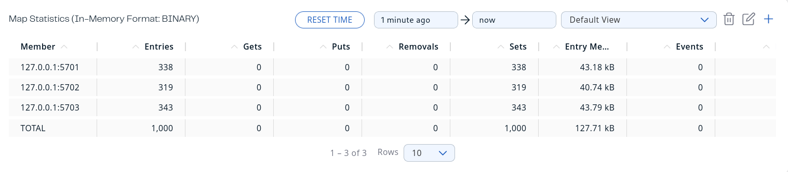
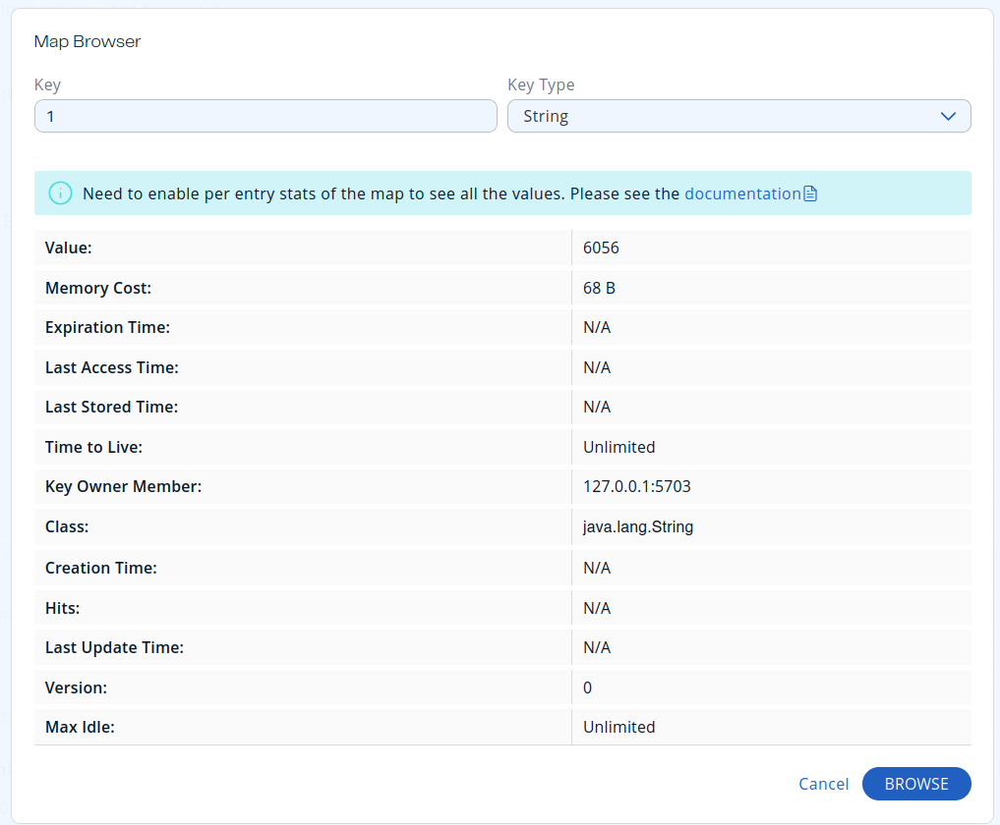
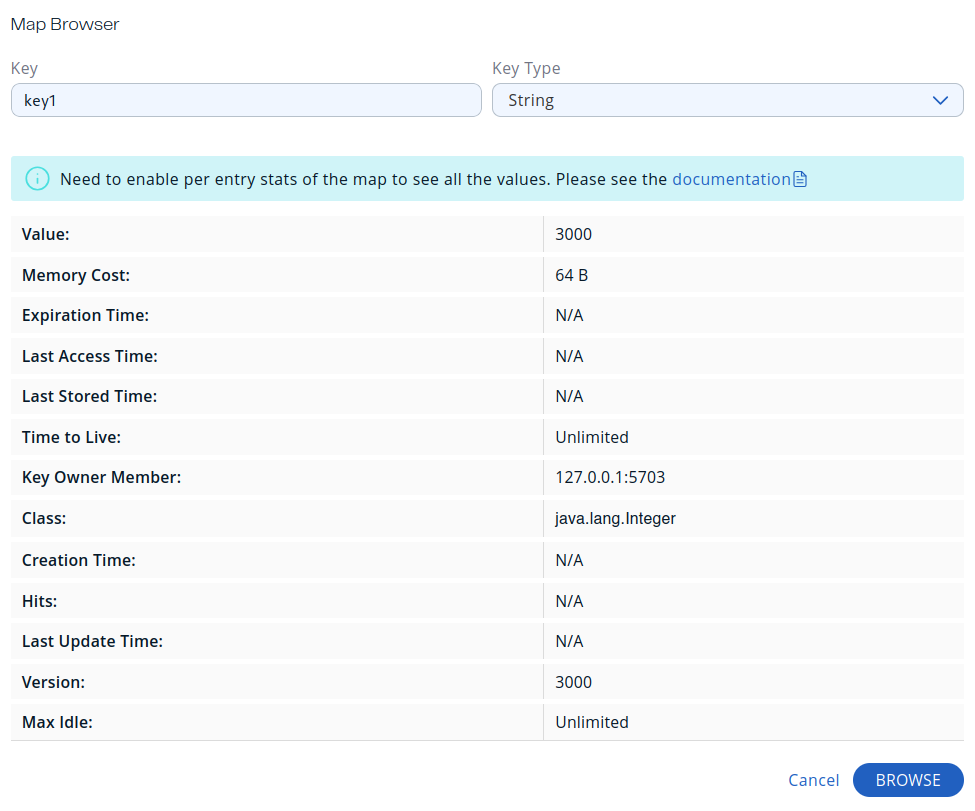

# Systems arch homework 2: hazelcast

## Setup

Firstly, I downloaded the tar distribution of hazelcast, and launched the management center:

```
.....Steps to unarchive hazelcast and cd into hazelcast-5.5.0.........
./management-center/bin/start.sh
```


Then, I launched three instances of hazelcast i one terminal:

```
./bin/hz start &
./bin/hz start &
./bin/hz start &
```

Lastly, I connected the management center to it:


## Adding items:

I have this script:

```python
#!/usr/bin/env python3

import hazelcast
import random

client = hazelcast.HazelcastClient()

distributed_map = client.get_map("distributed-map")

for i in range(1000):
    distributed_map.set(f"{i}", f"{random.randint(0, 10000)}").result()

print("Map size:", distributed_map.size().result())

client.shutdown()
```

Here are the results of it's execution in the management center:







After I disconnect one node by pkill:


After I disconnect two nodes by pkill:


TBH, If I just sent a PKILL signal, it would probably lose data, but doing this would be unreasonable, so I'll just skip this. Hazelcast saves data just fine, and data loss is improbable, so I consider the task done


I added this script:
```python
#!/usr/bin/env python3

import hazelcast

client = hazelcast.HazelcastClient()

distributed_map = client.get_map("distributed-map")

distributed_map.put_if_absent("key", 0).result()

for i in range(1000):
    val: int = distributed_map.get("key").result()
    val += 1
    distributed_map.put("key", val)

print("Map size:", distributed_map.size().result())

client.shutdown()
```

And the result is:


Which is logical - there's a race condition


With passimistic locks I got this:

```python
#!/usr/bin/env python3

import hazelcast

client = hazelcast.HazelcastClient()

distributed_map = client.get_map("distributed-map").blocking()

key = "key1"
distributed_map.put_if_absent(key, 0)

for i in range(1000):
    distributed_map.lock(key)
    try:
        value = distributed_map.get(key)
        value += 1
        distributed_map.put(key, value)
    finally:
        distributed_map.unlock(key)
print("Map size:", distributed_map.size())

client.shutdown()
```



```sh
[petro@shire scripts]$ time ./pessimistic_lock.py
Map size: 1004

real	0m2.773s
user	0m1.524s
sys	0m0.266s
```

Which is completely logical


And for optimistic locks as well:

```python
#!/usr/bin/env python3

import hazelcast

client = hazelcast.HazelcastClient()

distributed_map = client.get_map("distributed-map").blocking()

key = "key2"
distributed_map.put_if_absent(key, 0)

i = 0
while i < 1000:
    value = distributed_map.get(key)
    if distributed_map.replace_if_same(key, value, value + 1):
        i += 1
print("Map size:", distributed_map.size())

client.shutdown()
```


```sh
[petro@shire scripts]$ time ./optimistic_lock.py
Map size: 1004

real	0m2.086s
user	0m1.179s
sys	0m0.222s
```


Which is true, since the competition was low, but for when there's more clients, ity would be opposite. Optimistic locks are just atomics, and they are TERRIBLE when there's high resourtce contention.


## Bounded queue

So i set the queue size in an xml config as in the docs.

I added those lines:

```xml
<queue name="queue">
    <max-size>10</max-size>
</queue>
```

I also did this script:

```python
#!/usr/bin/env python3


import hazelcast
import threading
import time

client = hazelcast.HazelcastClient()

queue = client.get_queue("queue")


def produce():
    for i in range(100):
        queue.offer(i)


def make_consumer(cons_num=0):
    def consume():
        for _ in range(100):
            val = 0
            if queue.size() == 0:
                time.sleep(0.1)
            if queue.size() == 0:
                break
            val = queue.take().result()
            print(f"{cons_num=}, {val=}")

    return consume


producer_thread = threading.Thread(target=produce)

cons_1 = threading.Thread(target=make_consumer(1))
cons_2 = threading.Thread(target=make_consumer(2))

cons_1.start()
cons_2.start()
producer_thread.start()

cons_1.join()
cons_2.join()
producer_thread.join()

client.shutdown()
```

The results are:
```sh
[petro@shire scripts]$ ./queue.py
cons_num=1, val=0
cons_num=2, val=1
cons_num=1, val=2
cons_num=2, val=3
cons_num=1, val=4
cons_num=2, val=5
cons_num=1, val=6
cons_num=2, val=7
cons_num=1, val=8
cons_num=2, val=9
cons_num=1, val=10
cons_num=2, val=11
cons_num=1, val=12
cons_num=2, val=13
cons_num=1, val=14
cons_num=2, val=15
cons_num=1, val=16
cons_num=2, val=17
cons_num=1, val=18
cons_num=2, val=19
cons_num=1, val=20
cons_num=2, val=21
cons_num=1, val=22
cons_num=2, val=23
cons_num=2, val=25
cons_num=1, val=24
cons_num=2, val=26
cons_num=1, val=27
cons_num=2, val=28
cons_num=1, val=29
cons_num=2, val=30
cons_num=1, val=31
cons_num=2, val=32
cons_num=1, val=33
cons_num=2, val=34
cons_num=1, val=35
cons_num=2, val=36
cons_num=1, val=37
cons_num=2, val=38
cons_num=1, val=39
cons_num=2, val=40
cons_num=1, val=41
cons_num=2, val=42
cons_num=1, val=43
cons_num=2, val=44
cons_num=1, val=45
cons_num=2, val=46
cons_num=1, val=47
cons_num=2, val=48
cons_num=1, val=49
cons_num=2, val=50
cons_num=1, val=51
cons_num=2, val=52
cons_num=1, val=53
cons_num=2, val=54
cons_num=1, val=55
cons_num=2, val=56
cons_num=1, val=57
cons_num=2, val=58
cons_num=1, val=59
cons_num=2, val=60
cons_num=1, val=61
cons_num=2, val=62
cons_num=1, val=63
cons_num=2, val=64
cons_num=1, val=65
cons_num=2, val=66
cons_num=1, val=67
cons_num=2, val=68
cons_num=1, val=69
cons_num=2, val=70
cons_num=1, val=71
cons_num=2, val=72
cons_num=1, val=73
cons_num=2, val=74
cons_num=1, val=75
cons_num=2, val=76
cons_num=1, val=77
cons_num=2, val=78
cons_num=1, val=79
cons_num=2, val=80
cons_num=1, val=81
cons_num=2, val=82
cons_num=1, val=83
cons_num=1, val=85
cons_num=2, val=84
cons_num=1, val=86
cons_num=2, val=87
cons_num=1, val=88
cons_num=2, val=89
cons_num=1, val=90
cons_num=2, val=91
cons_num=1, val=92
cons_num=2, val=93
cons_num=1, val=94
cons_num=2, val=95
cons_num=1, val=96
cons_num=2, val=97
cons_num=1, val=98
cons_num=2, val=99
```

Which is fine, the consumers had mostly evenly distributed, which it seems to me is because the queue is a fair queue, which is nice)

Overall, the results are logical.
When there was no reading for the first few seconds, then the values were just dropped, so overall it's still predictable
